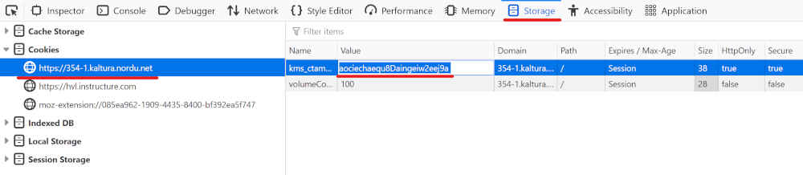

# kalturascraper.py

*Få enkel adgang til dine emners videofiler i canvas*

**kalturascraper.py** genererer en liste med URL-er til alle videoer i valgte emne. Disse URL-ene kan lastes ned dersom du har youtube-dl installert. Kun GNU/Linux og macOS er støttet. 

## Installasjon og kjøring
Du trenger først python3 installert. Deretter: 
- I kommandolinjen, for å installere moduler programmet trenger: 

        $ python3 -m pip install beautifulsoup4 requests
- Last ned selve programmet: 
    https://raw.githubusercontent.com/tmavro/canvasscraper/master/kalturascraper.py
    
- Naviger til filen med kommandolinjen og kjør: 

        $ python3 kalturascraper.py -h

## Konfigurasjon
Du gir argumet(er) via kommandolinjen. Programmet trenger din session cookie, minst ett emnes ID og tilhørende lokasjon for nedlasting.

    usage: kalturascraper.py [-h] -c COOKIE -g GALLERY -d DIRECTORY    
    
    optional arguments:                                          
      -h, --help                            show this help message and exit        
      -c COOKIE, --cookie COOKIE            set cookie value   
      -g GALLERY, --gallery GALLERY         set gallery or galleries to scrape       
      -d DIRECTORY, --directory DIRECTORY   set directory or directories to store files   

For å finne galleri-ID:
- Velg "Emne" fra menyen i Canvas
- Velg det aktuelle emnet
- ID-et er tallene i adresselinjen, etter "https://hvl.instructure.com/courses/" 

For å finne cookie: 
- Trykk på "Emnets mediefiler"
- I Firefox: Høyreklikk og velg "Inspiser element":
  - Velg "Storage", velg riktig nettside (https://354-1.kaltura.nordu.net/) og kopier verdien til "kms_ctamuls". 
</img>
- I andre nettlesere: Google it :-P 

Skriv verdiene inn i kalturascraper.py i de korresponderende variablene, "cookie" og "galleryID". Dersom du ikke definerer "dir" lastes filene ned i samme mappe som kalturascraper.py kjører i. 
